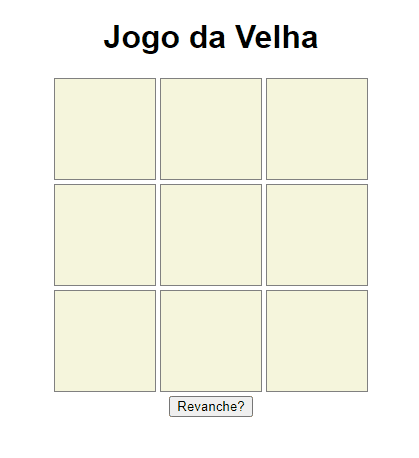

 
 

    <h1><i>Jogo da Velha</i></h1>

 

## 📕 About

A simple tic-tac-toe made in JavaScript.

Developed during the course [Web Development of ProgramadorBr (Igor Oliveira)](https://programadorbr.com/?src=adgogbst&gclid=Cj0KCQiA7YyCBhD_ARIsALkj54qE2fi1qXWkuSYf-f-29FmnlZO83P2l4aJ5-lNIlntFoIhiqvmXNrIaAh8nEALw_wcB)
  

## 💻 Preview

    

  

## 🔨 Tools

- HTML
- CSS
- JavaScript
  

## 🙋🏽‍♂️ Author

### Enzo Alexsander